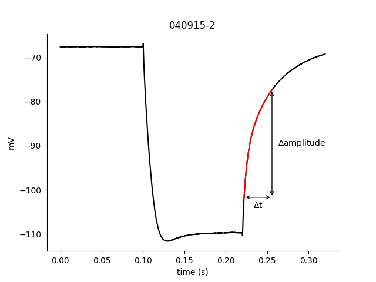

# Python package for analysis of neuronal whole cell patch clamp electrophysiological data. 
* see [NeuroClassify](github.com/RebeccaClarkson/NeuroClassify) for import to Matlab from Igor Pro
* README code taken from load_example.py and plot_example.py

First, import packages needed for these examples:
```python
    from neurospyke.plot_df_utils import D1_D3_scatter_plot
    from neurospyke.query import Query
    from neurospyke.utils import concat_dfs_by_index 
    from neurospyke.utils import load_cells 
    from neurospyke.utils import reorder_df 
    from tabulate import tabulate
```
### Import electrophysiological data from Matlab. 

Next, load cellular data that has been saved as .mat files. 
```python
    cell_file_pattern = 'docs/ExampleCells/*.mat' 
    example_cells = load_cells(cell_file_pattern)
```

### Query the electrophysiological properties of these cells. 
#### Each Query can include both desired criteria and properties to be calculated.

Query 1 examines an action potential spiking property, for sweeps that have .3 second current injection eliciting  5 spikes. For each  response that fits this criteria (as determined by use of "response_properties"), this query determines the doublet index (ratio of 2nd and 1st inter-spike intervals). Returned dataframe has average of these calculations.
```python
# Query 1 
    response_criteria = {'curr_duration':.3, 'num_spikes': 5}
    response_properties = ['doublet_index', 'delta_thresh', 'num_spikes', 'dVdt_at_percent_APamp__20__rising']
    query1 = Query(example_cells, response_criteria=response_criteria, 
            response_properties=response_properties)
    query1.run()
    df1 = query1.mean_df[['doublet_index', 'num_spikes', 'delta_thresh4', 'dVdt_at_percent_APamp__20__rising4']]
```
Query 2 examines a hyperpolarization-related property, with criteria set as having a .12 second/-400 pA current injection. This query calculates the rebound time constant of the average of all responses meeting these criteria, indicated by using "calculated_cell_properties." 
```python
    # Query 2
    response_criteria = {'curr_duration': .12, 'curr_amplitude': -400}
    calculated_cell_properties = ['reb_delta_t'] 
    query2 = Query(example_cells, response_criteria=response_criteria, 
            cell_properties=calculated_cell_properties)
    query2.run()
    df2 = query2.mean_df
```

### Aggregate the results of both queries
```python
    combined_df = concat_dfs_by_index(df1, df2)                                                                                           
    example_cells_df = reorder_df(combined_df, ['genetic_marker', 'ca_buffer', 'num_spikes'])    
    print(tabulate(example_cells_df.head(), headers='keys', tablefmt='pipe')) 
```
|          | genetic_marker   | ca_buffer   |   num_spikes |   doublet_index |   delta_thresh4 |   dVdt_at_percent_APamp__20__rising4 |   reb_delta_t |
|:---------|:-----------------|:------------|-------------:|----------------:|----------------:|-------------------------------------:|--------------:|
| 040915-2 | D3               | EGTA        |            5 |         2.23207 |         2.44333 |                              226.55  |         33.75 |
| 040915-4 | D3               | EGTA        |            5 |         3.17862 |         3.61333 |                              185.567 |         36.9  |
| 040915-7 | D3               | EGTA        |            5 |         3.00712 |         3.48444 |                              190.133 |         32.45 |
| 040915-9 | D3               | EGTA        |            5 |         4.78366 |         2.11556 |                              218.111 |         28.15 |
| 041015-3 | D3               | EGTA        |            5 |         2.52443 |         4.49333 |                              151.333 |         40.4  |

Example response used for reb_delta_t calculation: 
```python
    output_dir = 'docs/output/'
    query2.cells[0].plot_reb_delta_t(output_dir + 'example_reb_delta_t.png') 
```


### Plot the results of these queries
```
D1_D3_scatter_plot(example_cells_df, 'doublet_index', 'reb_delta_t', output_dir = output_dir)
```


Copyright 2017, Rebecca L. Clarkson. All rights reserved.
