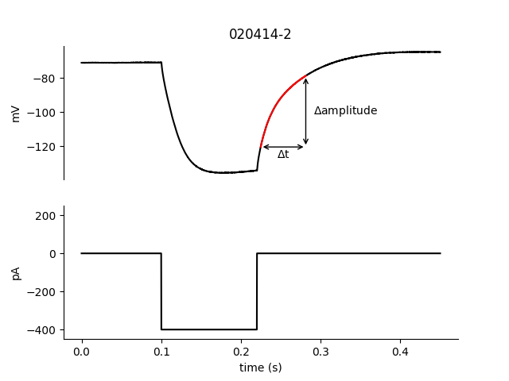

# Python package for analysis of neuronal whole cell patch clamp electrophysiological data 
* see [NeuroClassify](github.com/RebeccaClarkson/NeuroClassify) for import to Matlab from Igor Pro
* README code taken from docs/usage_example.py

First, import packages needed for these examples:
```python
    from neurospyke.plot_df_utils import D1_D3_scatter_subplots
    from neurospyke.query import Query
    from neurospyke.utils import concat_dfs_by_index 
    from neurospyke.utils import load_cells 
    from neurospyke.utils import reorder_df 
    from tabulate import tabulate
```
### Import electrophysiological data from Matlab. 

Next, load cellular data that has been saved as .mat files. 
```python
    cell_file_pattern = 'docs/ExampleCells/*.mat' 
    example_cells = load_cells(cell_file_pattern)
```

### Query the electrophysiological properties of these cells. 
#### Each Query can include both desired criteria and properties to be calculated.

Query 1 examines an action potential spiking property, for sweeps that have .3 second current injection eliciting  5 spikes. For each  response that fits this criteria (as determined by use of "response_properties"), this query assesses three different spiking properties, with the returned dataframe having the average of these calculations: 

1. 'doublet_index': ratio of 2nd and 1st inter-spike intervals
2. 'delta_thresh': change in threshold over the course of the AP train
3. 'dVdt_pct_APamp__20__rising': dVdt of the AP rising phase at 20% of AP amplitude

```python
# Query 1 
response_criteria = {'sweep_time': '<150', 'curr_duration':.3, 'num_spikes': 5}
response_properties = [
    'num_spikes', 
    'doublet_index', 
    'delta_thresh', 
    'dVdt_pct_APamp__20__rising'
    ]

query1 = Query.create_or_load_from_cache(
        example_cells, 
        response_criteria=response_criteria, 
        response_properties=response_properties,
        )
df1 = query1.mean_df
```
Query 2 examines hyperpolarization-related properties, with criteria set as having a .12 second/-400 pA current injection. This query calculates sag and rebound properties based on the average of all responses meeting these criteria, indicated by setting these properties in "calculated_cell_properties." 
```python
# Query 2
response_criteria = {'curr_duration': .12, 'curr_amplitude': -400}
calculated_cell_properties = ['reb_delta_t', 'sag_fit_amplitude'] 
query2 = Query.create_or_load_from_cache(
        example_cells, 
        response_criteria=response_criteria, 
        cell_properties=calculated_cell_properties,
        )
df2 = query2.mean_df

```

### Aggregate the results of both queries
```python
combined_df = concat_dfs_by_index(df1, df2)                                                                                           
example_cells_df = reorder_df(combined_df, ['genetic_marker', 'ca_buffer', 'num_spikes'])    
print(tabulate(example_cells_df.head(), headers='keys', tablefmt='pipe')) 
```
|          | genetic_marker   | ca_buffer   |   num_spikes |   dVdt_pct_APamp__20__rising0 |   dVdt_pct_APamp__20__rising1 |   dVdt_pct_APamp__20__rising2 |   dVdt_pct_APamp__20__rising3 |   dVdt_pct_APamp__20__rising4 |   delta_thresh0 |   delta_thresh1 |   delta_thresh2 |   delta_thresh3 |   delta_thresh4 |   doublet_index |   reb_delta_t |   sag_fit_amplitude |
|:---------|:-----------------|:------------|-------------:|------------------------------:|------------------------------:|------------------------------:|------------------------------:|------------------------------:|----------------:|----------------:|----------------:|----------------:|----------------:|----------------:|--------------:|--------------------:|
| 040915-2 | D3               | EGTA        |            5 |                       242.7   |                       230.967 |                       237.8   |                       231.467 |                       233.4   |               0 |         2.54    |         1.85333 |         1.75667 |         2.24667 |         2.44884 |         33.75 |            -2.12921 |
| 040915-4 | D3               | EGTA        |            5 |                       262.2   |                       140.167 |                       177.733 |                       180.667 |                       185.567 |               0 |         5.22667 |         3.17333 |         3.76    |         3.61333 |         3.17862 |         36.9  |            -2.58267 |
| 040915-7 | D3               | EGTA        |            5 |                       241.867 |                       134.089 |                       179.022 |                       196.956 |                       190.133 |               0 |         5.40444 |         3.84222 |         4.03778 |         3.48444 |         3.00712 |         32.45 |            -2.06709 |
| 040915-9 | D3               | EGTA        |            5 |                       334.311 |                       127.622 |                       222.689 |                       238.911 |                       218.111 |               0 |         6.11778 |         3.61333 |         1.66    |         2.11556 |         4.78366 |         28.15 |            -2.61145 |
| 041015-3 | D3               | EGTA        |            5 |                       260.733 |                       142.6   |                       167     |                       162.133 |                       151.333 |               0 |         3.12667 |         2.64    |         4.49333 |         4.49333 |         2.52443 |         40.4  |            -1.77217 |

Example sweeps used for AP property calculations:
```python
output_dir = 'docs/output/'
query1.cells[0].plot_sweeps(filepath=output_dir + '5AP_example.png')
```


Example response used for reb_delta_t calculation: 
```python
query2.cells[0].plot_reb_delta_t(output_dir + 'example_reb_delta_t.png') 
```


### Plot the results of these queries
```python
comparisons = [
        ('sag_fit_amplitude', 'reb_delta_t'), 
        ('doublet_index', 'delta_thresh4'),
        ('doublet_index', 'dVdt_pct_APamp__20__rising4'),
        ('delta_thresh4', 'dVdt_pct_APamp__20__rising4'), 
        ]
D1_D3_scatter_subplots(example_cells_df, comparisons, output_path=output_dir + 'D1_vs_D3_ephys.png')
```


Copyright 2017, Rebecca L. Clarkson. All rights reserved.
